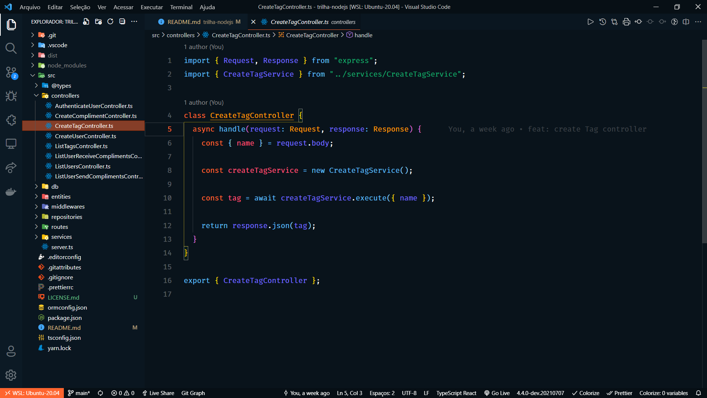

<h1 align="center">Valoriza</h1>

<p align="center">
  
</p>

<p align="center">
  

  
</p>

<br>

## 🧪 Tecnologias utilizadas

Para este projeto, foram utilizadas as seguintes tecnologias:

- [Node.js](https://nodejs.org/en/)
- [Typescript](https://www.typescriptlang.org/)
- [Express](https://expressjs.com/pt-br/)
- [JSONWebToken](https://github.com/auth0/node-jsonwebtoken#readme)

## 🚀 Como executar

Passo 1: Faça a clonagem do projeto com o comando abaixo:

```bash
$ git clone https://github.com/fsclaro/nlw-06-trilha-nodejs
```

Passo 2: Entre na pasta do projeto:

```bash
$ cd nlw-06-trilha-nodejs
```

Passo 3: Inicie o projeto conforme os passos descritos abaixo:

```bash
# Instalar as dependências
$ yarn

# Criar o banco de dados e as tabelas do projeto
$ yarn typeorm migration:run

# Iniciar o projeto
$ yarn dev
```
O app estará disponível no seu browser pelo endereço http://localhost:3000.

## 💻 Projeto

Valoriza é uma plataforma para promover o reconhecimento entre companheiros de equipe.

Este é um projeto desenvolvido durante a **[Next Level Week Together](https://nextlevelweek.com/)**, apresentada dos dias 20 a 27 de Junho de 2021.

## 📝 Licença

Esse projeto está sob a licença MIT. Veja o arquivo [LICENSE](LICENSE.md) para mais detalhes.

---

Feito com ❤️ by NandoSalles baseado no projeto original do [NLW 6 da Rocketseat](https://rocketseat.com.br).
